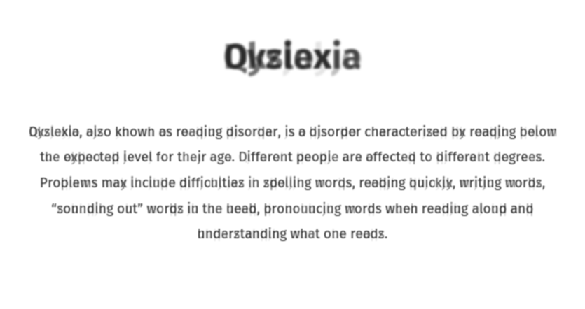

# Dyslexia Simulator
A dyslexia simulation that aims to be a bit more accurate by attempting to replicate the experience of fatigue while reading.  Text is blurred, and similar characters are overlayed at varying opacity.



## Getting Started

First, run the development server:

```bash
npm run dev
# or
yarn dev
```

Open [http://localhost:3000](http://localhost:3000) with your browser to see the result.

You can start editing the page by modifying `pages/index.tsx`. The page auto-updates as you edit the file.